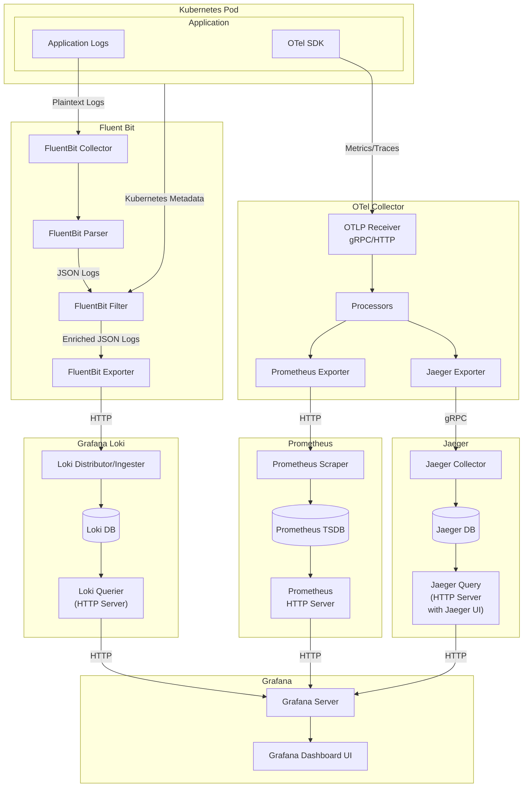

# Mermaid Graph

```mermaid
flowchart TB
subgraph od[Kubernetes Pod]
    subgraph app[Application]
        ot-sdk[OTel SDK]
        app-log[Application Logs]
    end
end

app-log -->|"Plaintext Logs"| fb-in
od -->|"Kubernetes Metadata"| fb-filter
ot-sdk -->|"Metrics/Traces"| oc-recv

subgraph fb[Fluent Bit]
    fb-in[FluentBit Collector]
    fb-parse[FluentBit Parser]
    fb-filter[FluentBit Filter]
    fb-out[FluentBit Exporter]

    fb-in --> fb-parse
    fb-parse -->|JSON Logs| fb-filter
    fb-filter -->|Enriched JSON Logs| fb-out
end

fb-out -->|HTTP| lk-in

subgraph oc[OTel Collector]
    oc-recv["OTLP Receiver<br/>gRPC/HTTP"]
    oc-proc[Processors]
    oc-prom["Prometheus Exporter"]
    oc-jag["Jaeger Exporter"]

    oc-recv --> oc-proc
    oc-proc --> oc-prom
    oc-proc --> oc-jag
end

oc-prom -->|HTTP| pr-sc
oc-jag -->|gRPC| ja-col

subgraph lk[Grafana Loki]
    lk-in["Loki Distributor/Ingester"]
    lk-db[(Loki DB)]
    lk-http["Loki Querier<br/>(HTTP Server)"]

    lk-in --> lk-db
    lk-db --> lk-http
end

subgraph pr[Prometheus]
    pr-sc["Prometheus Scraper"]
    pr-tsdb[(Prometheus TSDB)]
    pr-http["Prometheus<br/>HTTP Server"]

    pr-sc --> pr-tsdb
    pr-tsdb --> pr-http
end

subgraph ja[Jaeger]
    ja-col["Jaeger Collector"]
    ja-db[(Jaeger DB)]
    ja-http["Jaeger Query<br/>(HTTP Server<br/>with Jaeger UI)"]

    ja-col --> ja-db
    ja-db --> ja-http
end


lk-http -->|HTTP| gr-srv
pr-http -->|HTTP| gr-srv
ja-http -->|HTTP| gr-srv

subgraph gr[Grafana]
    gr-srv["Grafana Server"]
    gr-ui["Grafana Dashboard UI"]

    gr-srv --> gr-ui
end
```